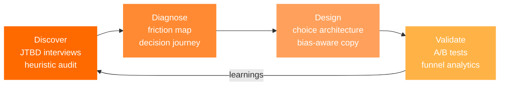

  

  
  
  

## About

Creative and Tech lead at **E3 Digital**, a solutions hub for law firms in Brazil.

My core discipline is **user experience grounded in behavioral science**. I map how a person actually reaches a decision (the friction, the doubts, the shortcuts the brain takes) and design the interface around that path. The strategy, the research and the decision architecture are mine.

For the build I work AI-first: I pair with LLM agents to ship production code fast, which lets a behavioral hypothesis go from whiteboard to a live A/B test in days instead of sprints.

## Method

## Behavioral toolkit

<b>Cognitive biases I design with</b>

 

- **Anchoring and decoy effect:** tiered pricing where the middle plan is the rational choice.
- **Loss aversion:** framing the cost of inaction instead of the gain of acting.
- **Social proof:** proof placed at the exact point of hesitation, never as a detached block.
- **Default effect:** preselected options that match the most common intent.
- **Scarcity and urgency:** only when real, like deadlines and limited seats.
- **Goal gradient and Zeigarnik effect:** visible progress in multi-step flows and diagnostics.
- **Peak-end rule:** designing the last screen of a flow as carefully as the first.
- **Serial position effect:** the strongest argument opens, the second strongest closes.
- **Authority bias:** credentials surfaced where the risk feels highest.
- **Cognitive load, Hick's law and Fitts's law:** fewer choices per screen, bigger targets for the primary action.

<b>Frameworks and methodologies</b>

 

- Fogg Behavior Model (B = MAP) to diagnose why a user does not act
- COM-B and the EAST framework (Easy, Attractive, Social, Timely)
- Jobs to be Done for research and positioning
- Double Diamond for discovery and delivery
- Nielsen's 10 usability heuristics for audits
- Hook Model for retention loops
- Kano Model for feature prioritization
- AARRR pirate metrics to read the funnel

## Selected work

- **[Accident benefit landing page](https://lp-auxilio-acidente-nine.vercel.app):** 16 sections, each one built on a specific cognitive bias for a social security law practice.
- **[A Maleta do Advogado](https://maleta-lp-v2.vercel.app):** sales page for a digital product with a scroll-driven 3D briefcase, anchored three-tier pricing and pain-first plan cards.
- **[Minutta AI agent](https://minutta-lp-ia.vercel.app):** landing page for a legal CRM with an animated chat hero and motion kanban boards that show the product before asking for the lead.
- **E3 Diagnostic:** maturity assessment for law firms that turns answers into a personalized PDF report.
- **Ultra.Art:** in-browser Instagram carousel generator with 15 templates and AI-written copy.

## Stack

  

## Activity

  
  

<picture>
  <source media="(prefers-color-scheme: dark)" srcset="https://raw.githubusercontent.com/gabape4-gif/gabape4-gif/output/snake-dark.svg"/>
  
</picture>

